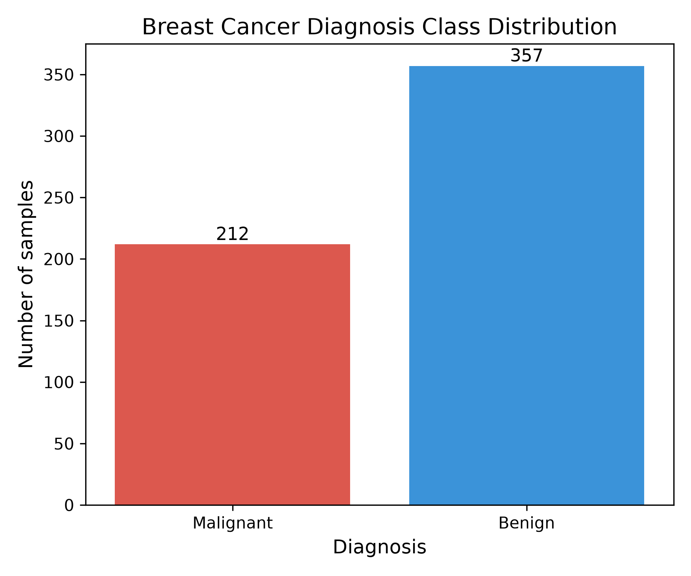
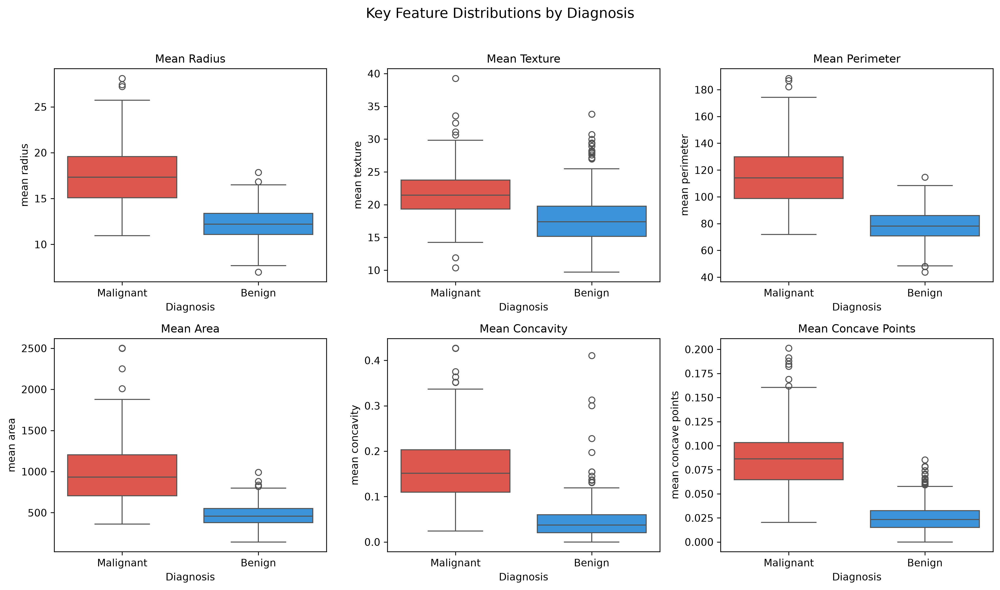
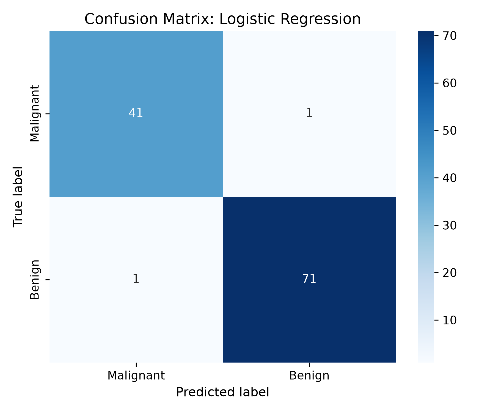

# Exploratory Breast Cancer Diagnostic Data Analysis in Python 
 
## Project objective 
 
This educational project demonstrates an exploratory data analysis and introductory machine-learning workflow in Python using the Breast Cancer Wisconsin (Diagnostic) dataset. 
 
The project uses `pandas`, `numpy`, `matplotlib`, `seaborn`, and `scikit-learn` to inspect data quality, calculate descriptive statistics, visualise diagnostic-feature patterns, and train and evaluate a basic logistic-regression classifier. 
 
## Dataset 
 
The analysis uses the Breast Cancer Wisconsin (Diagnostic) dataset, loaded through `scikit-learn`. 
 
The dataset contains measurements derived from digitised images of fine-needle aspirates of breast masses. 
 
- Total samples: 569 
- Benign samples: 357 
- Malignant samples: 212 
- Numeric diagnostic features: 30 
- Missing values: 0 
 
The dataset is a historic public educational dataset. It must not be used for diagnosis, clinical decision-making, or medical advice. 
 
## Analysis workflow 
 
1. Loaded the dataset using `scikit-learn`. 
2. Created a `pandas` DataFrame with numeric features and diagnosis labels. 
3. Checked dataset dimensions, missing values, data types, and class balance. 
4. Calculated descriptive statistics. 
5. Created visualisations: 
  - Diagnosis class-distribution bar chart 
  - Feature boxplots by diagnosis 
  - Correlation heatmap of mean features 
  - Scatter plot of mean radius versus mean concavity 
6. Split the data into training and test sets using stratified sampling. 
7. Standardised features using `StandardScaler`, fitted on training data only. 
8. Trained a logistic-regression classifier. 
9. Evaluated the model using test accuracy, precision, recall, F1 score, and a confusion matrix. 
10. Saved output figures and tables in structured folders. 
 
## Key results 
 
- Dataset shape: 569 samples and 30 numeric features. 
- No missing values were identified. 
- The dataset contains 357 benign and 212 malignant samples. 
- Malignant samples showed higher values for several features, including mean radius, perimeter, area, concavity, and concave points. 
- Logistic regression achieved **98.25% test accuracy** on a stratified held-out test set of 114 samples. 
- Malignant class: precision 0.98, recall 0.98, F1 score 0.98. 
- Benign class: precision 0.99, recall 0.99, F1 score 0.99. 
 
## Important interpretation 
 
The strong test performance is consistent with known benchmarks for this historic dataset and its relatively separable diagnostic features. It is not a novel clinical result and does not establish clinical utility. 
 
This notebook is an educational demonstration of reproducible Python data analysis and introductory classification. It must not be used for patient diagnosis, treatment decisions, or medical advice. 
 
## Key visualisations 
 
### Diagnosis class distribution 
 
 
 
### Key diagnostic-feature distributions 
 
 
 
### Confusion matrix 
 
 
 
## Project structure 
 
```text 
05_python_breast_cancer_data_analysis/ 
├── data_processed/ 
│   └── breast_cancer_dataframe.csv 
├── notebooks/ 
│   └── 01_breast_cancer_eda.ipynb 
├── outputs/ 
│   ├── figures/ 
│   └── tables/ 
├── reports/ 
├── scripts/ 
├── references/ 
├── README.md 
└── requirements.txt 
 

## Key outputs 
 
### Figures 
 
- `outputs/figures/class_distribution_barplot.png` 
- `outputs/figures/key_features_boxplots.png` 
- `outputs/figures/mean_features_correlation_heatmap.png` 
- `outputs/figures/radius_vs_concavity_scatter.png` 
- `outputs/figures/confusion_matrix.png` 
 
### Tables 
 
- `outputs/tables/class_distribution.csv` 
- `outputs/tables/descriptive_statistics.csv` 
- `outputs/tables/logistic_regression_classification_report.csv` 
- `outputs/tables/model_accuracy_summary.csv` 
- `outputs/tables/python_data_quality_summary.csv` 
 
## Reproducibility 
 
### Create and activate the environment 
 
```bash 
conda create --name biomedical-python python=3.12 
conda activate biomedical-python 
 

Install dependencies 

conda install pandas numpy matplotlib seaborn scikit-learn jupyterlab 
 

Launch JupyterLab 

jupyter lab 
 

Then run: 

notebooks/01_breast_cancer_eda.ipynb 
 

from top to bottom. 

Limitations 

The dataset is historic and has only 569 samples. 

The data may not represent current clinical populations, clinical workflows, or imaging technologies. 

The workflow uses one train/test split rather than cross-validation. 

No hyperparameter tuning, external validation, calibration analysis, fairness assessment, or prospective validation was performed. 

The model is for educational demonstration only and is not clinically deployable. 

Technical skills demonstrated 

Python 

JupyterLab 

pandas 

NumPy 

matplotlib 

seaborn 

scikit-learn 

Exploratory data analysis 

Data-quality assessment 

Data visualisation 

Train/test splitting 

Feature scaling 

Logistic regression 

Classification evaluation 

Reproducible project organisation 