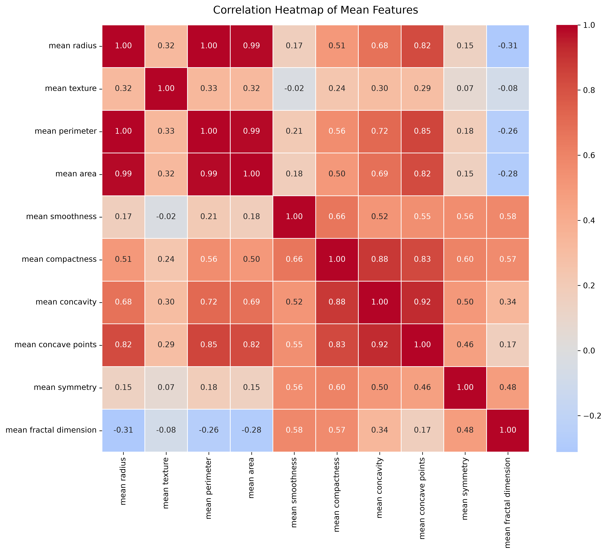
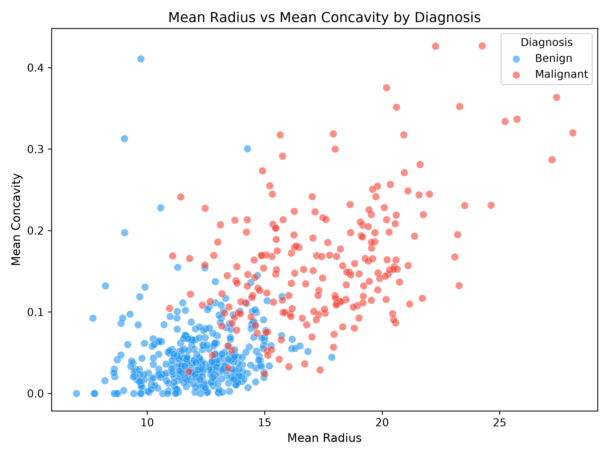

--- 
title: "Exploratory Breast Cancer Diagnostic Data Analysis in Python" 
author: "Akash Bhardwaj" 
date: today 
 
format: 
 html: 
   toc: true 
   toc-depth: 2 
   theme: cosmo 
   embed-resources: true 
 
execute: 
 echo: false 
 warning: false 
 message: false 
--- 
 
## Project objective 
 
This educational project demonstrates an exploratory data analysis and introductory machine-learning workflow in Python using the Breast Cancer Wisconsin (Diagnostic) dataset. 
 
The workflow includes data-quality checks, descriptive statistics, visualisation, train/test splitting, feature scaling, logistic regression, and classification evaluation. 
 
## Dataset 
 
The Breast Cancer Wisconsin (Diagnostic) dataset was loaded through `scikit-learn`. 
 
- Total samples: 569 
- Benign samples: 357 
- Malignant samples: 212 
- Numeric diagnostic features: 30 
- Missing values: 0 
- Duplicate rows: 0 
 
The dataset contains measurements derived from digitised images of fine-needle aspirates of breast masses. It is a historic public dataset for educational use and must not be used for diagnosis, clinical decision-making, or medical advice. 
 
## Data-quality assessment 
 
A reusable Python script checked the processed dataset for row and column counts, missing values, duplicate rows, and diagnostic-class counts. 
 
The checks found 569 rows, 32 columns, no missing values, and no duplicate rows. 
 
## Exploratory data analysis 
 
### Diagnosis class distribution 
 
 
 
The dataset contains more benign samples than malignant samples. 
 
### Key diagnostic-feature distributions 
 
 
 
Several diagnostic features, including mean radius, perimeter, area, concavity, and concave points, showed higher values among malignant samples in this dataset. 
 
### Correlation of mean diagnostic features 
 
 
 
Several size-related features are strongly correlated. For example, mean radius, mean perimeter, and mean area measure related geometric properties and therefore should not be interpreted as independent signals. 
 
### Mean radius and mean concavity 
 
 
 
The scatter plot shows broad separation between diagnostic classes, although overlap remains between some samples. 
 
## Introductory logistic-regression classification 
 
The dataset was split into training and test sets using an 80:20 stratified split. Features were standardised using `StandardScaler`, fitted on the training data only. A logistic-regression classifier was then fitted using the training data. 
 
### Test-set performance 
 
- Test-set samples: 114 
- Test accuracy: 98.25% 
- Malignant class: precision 0.98, recall 0.98, F1 score 0.98 
- Benign class: precision 0.99, recall 0.99, F1 score 0.99 
 
### Confusion matrix 
 
 
 
The high test performance is consistent with known benchmarks for this dataset and the relatively separable diagnostic features. It does not establish clinical utility. 
 
## Reproducibility 
 
The analysis was completed in a dedicated Conda environment using: 
 
```bash 
conda create --name biomedical-python python=3.12 
conda activate biomedical-python 
conda install pandas numpy matplotlib seaborn scikit-learn jupyterlab 
 

The primary analysis notebook is: 

notebooks/01_breast_cancer_eda.ipynb 
 

The reusable data-quality script is: 

scripts/01_data_quality_check.py 
 

Run the quality-control script from the project root using: 

python scripts/01_data_quality_check.py 
 

Limitations 

This is a historic public dataset containing 569 samples. 

The data may not represent current clinical populations, imaging systems, laboratory workflows, or diagnostic practice. 

The workflow uses one fixed train/test split rather than cross-validation. 

No hyperparameter tuning, external validation, calibration analysis, fairness assessment, prospective validation, or regulatory review was performed. 

The analysis is educational only and the model is not clinically deployable. 

Conclusion 

This project demonstrates a reproducible Python workflow for biomedical data-quality assessment, exploratory analysis, visualisation, and introductory classification evaluation. 

The key lesson is that strong performance on a small historic public dataset does not by itself demonstrate clinical usefulness.